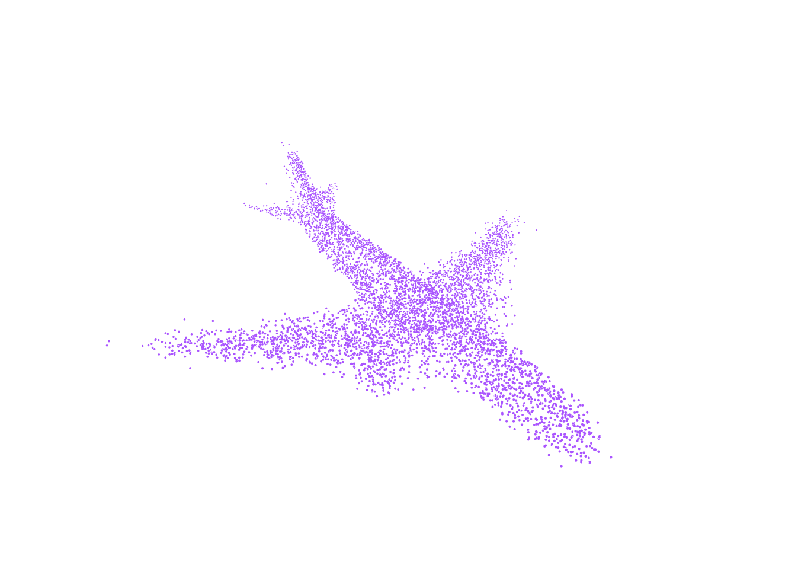
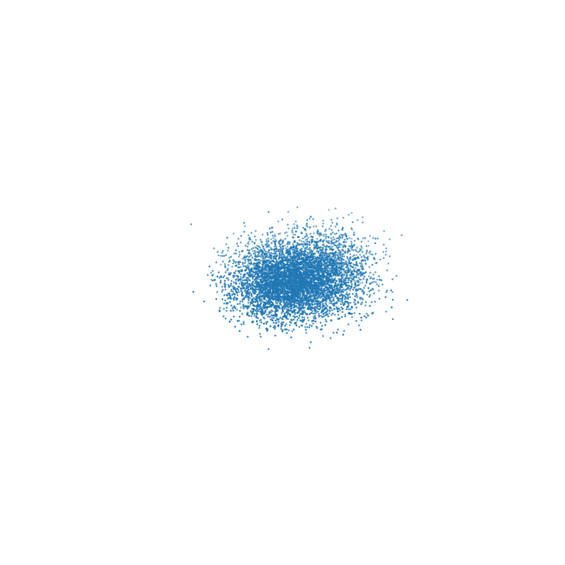

# Diffusion

简单的基于扩散模型的3D形状生成。

北京大学《几何计算前沿》课程期末大作业。

2024春。

## 数据集

选用了ShapeNet里的`airplane, chair, table`三类作为数据集，保存在`dataloader/dataset/dataset`文件夹下。

## Quickstart

运行`python train.py`进行训练模型，训练后的模型会保存在`ckpts/uncondition`文件夹下。

运行`python generate.py`进行生成，生成的结果会保存到`results/`文件夹下。`results`文件夹下有`airplane, chair, table`三个子文件夹，分别保存了对应类别的生成结果。

每个子文件夹里会将扩散的全过程进行保存，其格式为`i_x_t_y.ply`代表生成的第x个模型扩散步骤进行到第y步的结果。当y=0时代表最终的扩散结果。

运行`python visualize.py`进行扩散过程的可视化（取最后100步进行可视化），可视化的结果保存在`results/gif`文件夹下。

## 参数设置

训练和生成的参数可以在`config.py`里进行设置，详见`config.py`内的注释。

`visualize.py`可以通过命令行参数调整对哪一种类别的模型（`airplane,chair,table`）的第x个生成结果进行可视化。

## 实验结果

以`config.py`中的默认参数分别对`airplane,chair,table`三类模型进行训练，生成结果如下：

扩散过程可视化如下：

